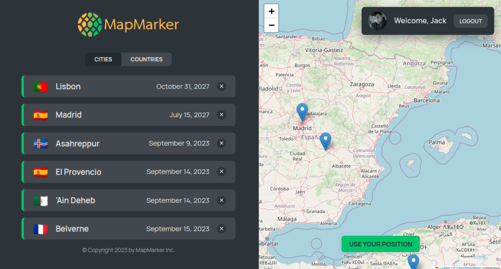
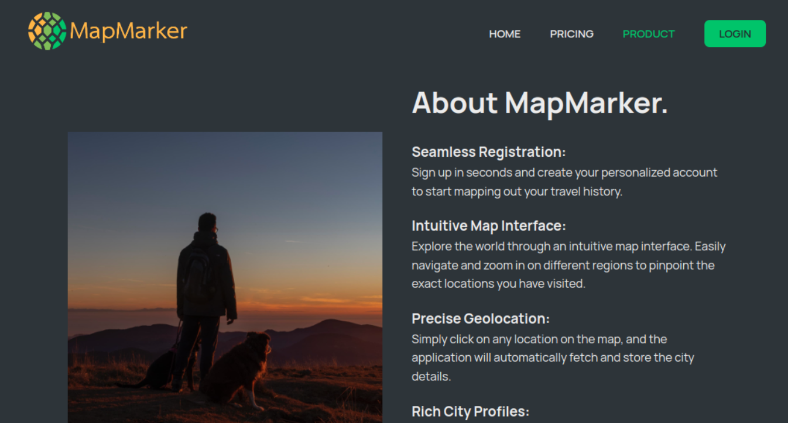

# MapMarker

MapMarker is a React-based single-page application where users can register all the cities that they have ever traveled to.

## Features of App

- User can explore the world through an intuitive map interface. Easily navigate and zoom in on different regions.
- User can create a list of cities he have visited. User simply click on any location on the map, and the application will automatically fetch and store the city details.
- Each city user added comes to life with rich details, including its name, country, and additional notes user want to attach.
- User also can delete cities from the list.

## Tech Stack

- React
- React Router
- CSS Modules
- React Leaflet
- React Datepicker
- Vite

### Short demovideo


### Pages






## Setup

Install dependencies with

```sh
npm install
```

### [Frontend] Running Webpack Development Server

```sh
npm run dev
```

### [Backend] Running Backend Servier

```sh
npm run server
```
